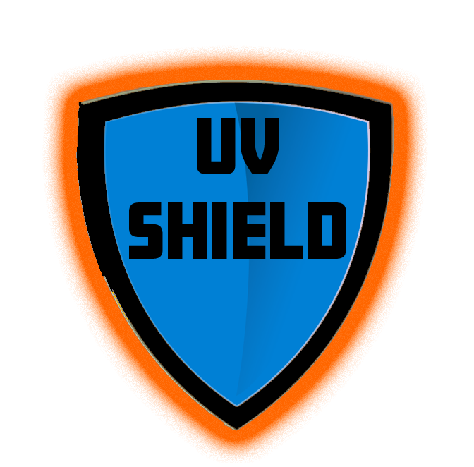
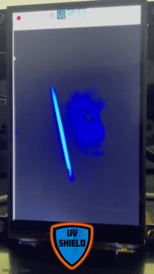

#    UV Shield 
## README

UV Shield is a handheld component that allows users to see incoming UV rays on their skin. 
The purpose of the component is to assist users with applying UV protection before going outdoors.

## OPERATION PROCEDURES
To operate the UV Shield component follow these step by step instructions:
1. Press the power button
2. Device should automatically boot up and display the UV Shield logo.
3. After the logo, UV Shield should bootup to display the camera feed.
4. Use the second button to toggle the UV LEDs when indoors.
5. Press the power button to initiate the shutdown process to safely shutdown the UV Shield.

## CONTACT

stevenamberman@ufl.edu

## GIT

The github repository for this project can be found at:
  https://github.com/alexistodd/UVis
 
 
## DISCLAIMER

UVis does not guarentee your safety from harmful UV rays when going outside. This component will assist you with sunscreen application,
but it does not guarentee safety from UV radiation.
